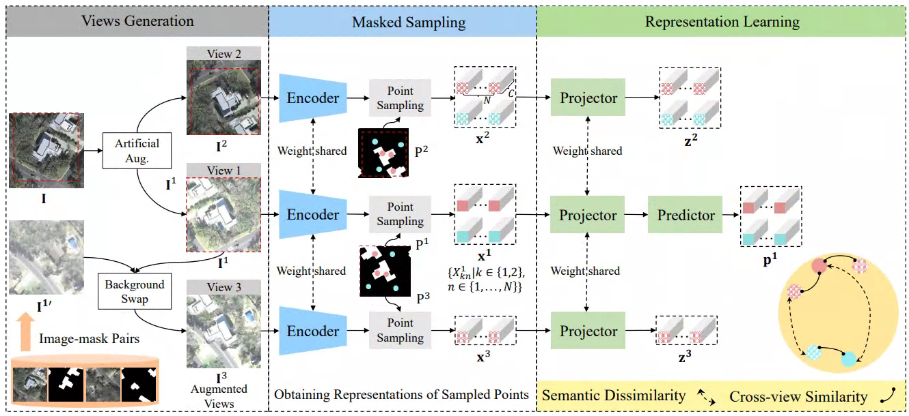

# SaDL_CD
Here, we provide the pytorch implementation of the paper: Semantic-Aware Dense Representation Learning for Remote Sensing Image Change Detection.

For more ore information, please see our published paper at [IEEE TGRS](https://ieeexplore.ieee.org/document/9874899/) or [arxiv](https://arxiv.org/abs/2205.13769). 



Coming soon~~

## Requirements

## Installation

Clone this repo:

```shell
git clone https://github.com/justchenhao/SaDL_CD.git
cd SaDL_CD
```

## Quick Start

## Training

## Evaluation

## Dataset Preparation

### Data structure

```
"""
Change detection data set with pixel-level binary labels；
├─A
├─B
├─label
└─list
"""
```

### Data Download 

LEVIR-CD: https://justchenhao.github.io/LEVIR/

WHU-CD: https://study.rsgis.whu.edu.cn/pages/download/building_dataset.html

GZ-CD: https://github.com/daifeng2016/Change-Detection-Dataset-for-High-Resolution-Satellite-Imagery

## License

Code is released for non-commercial and research purposes **only**. For commercial purposes, please contact the authors.

## Citation

If you use this code for your research, please cite our paper:

```
@Article{chen2022,
    title={Semantic-Aware Dense Representation Learning for Remote Sensing Image Change Detection},
    author={Hao Chen, Wenyuan Li, Song Chen and Zhenwei Shi},
    year={2022},
    journal={IEEE Transactions on Geoscience and Remote Sensing},
    volume={},
    number={},
    pages={1-18},
    doi={10.1109/TGRS.2022.3203769}
}
```

